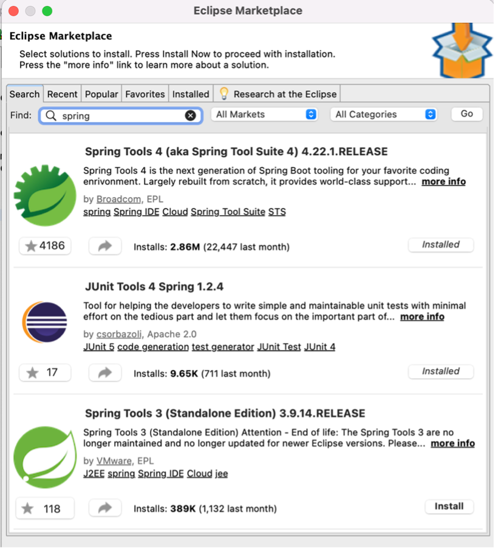
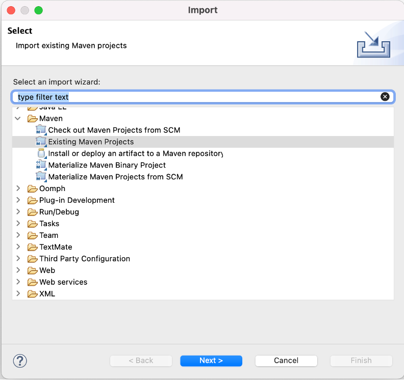
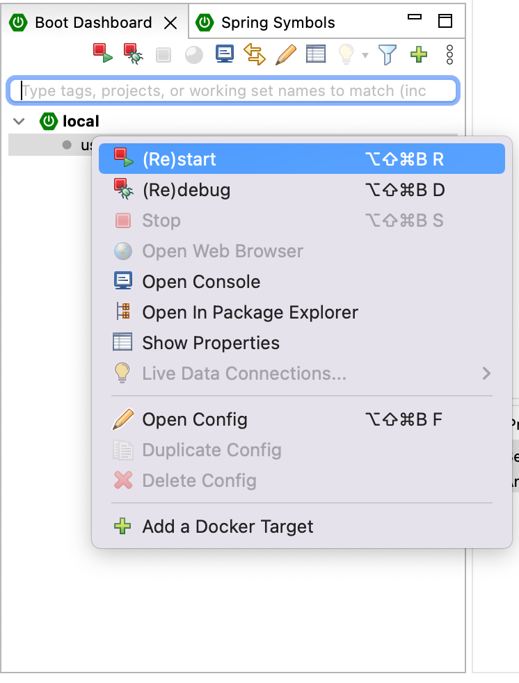

# Starting project inside Eclipse

After successfully downloading and installing Java, Eclipse, Mvn, and git, let’s start by installing **Spring Tools** and **JUnit Tools 4 Spring** from the Eclipse Marketplace, `Help > Eclipse Marketplace`.

After finishing the required installations and configuration, let's modify some views inside Eclipse `Window > Show View > Other...`. A popup will show ‘Show View’ search for spring and select “Other/Spring Symbols.”
 

After successfully installing the required plugins from the Eclipse marketplace, let’s import the project downloaded in the previous steps. Select F`File > Import > Maven > Existing Maven Projects` from the Eclipse main menu.

It is time to start our project from the Boot Dashboard/ `local/user-profile-ms`. Right-click and then select **(Re)start**. This will start by downloading the required dependencies and files.

From the Console tab, you can check the console logs showing the project’s start and initialization.

---
