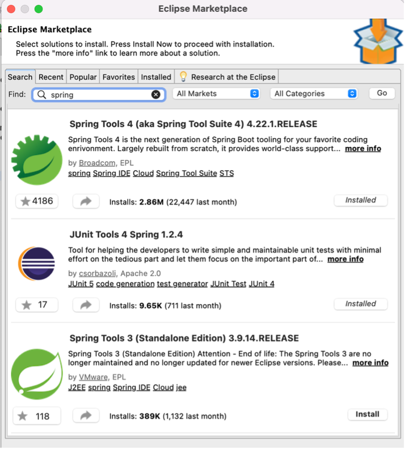
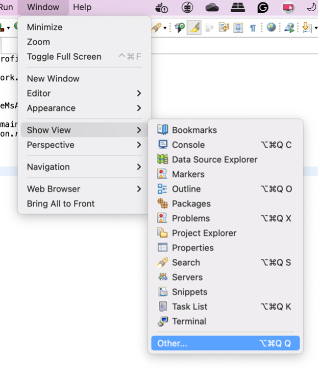
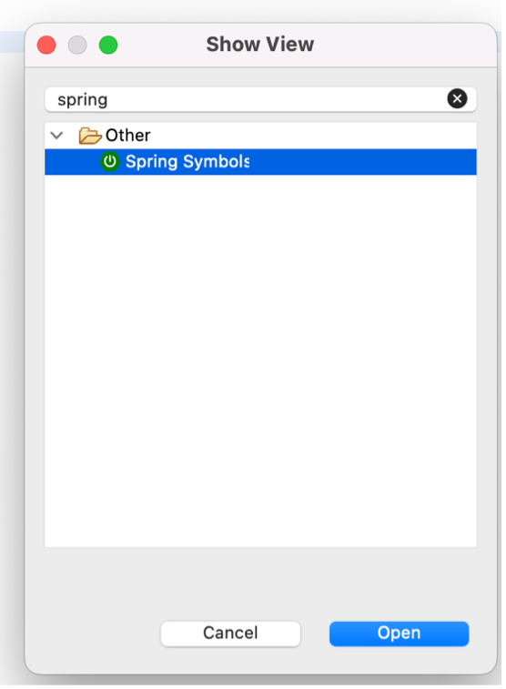
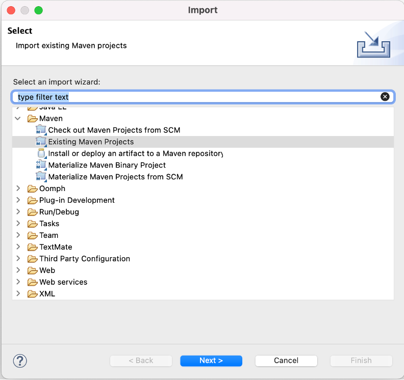
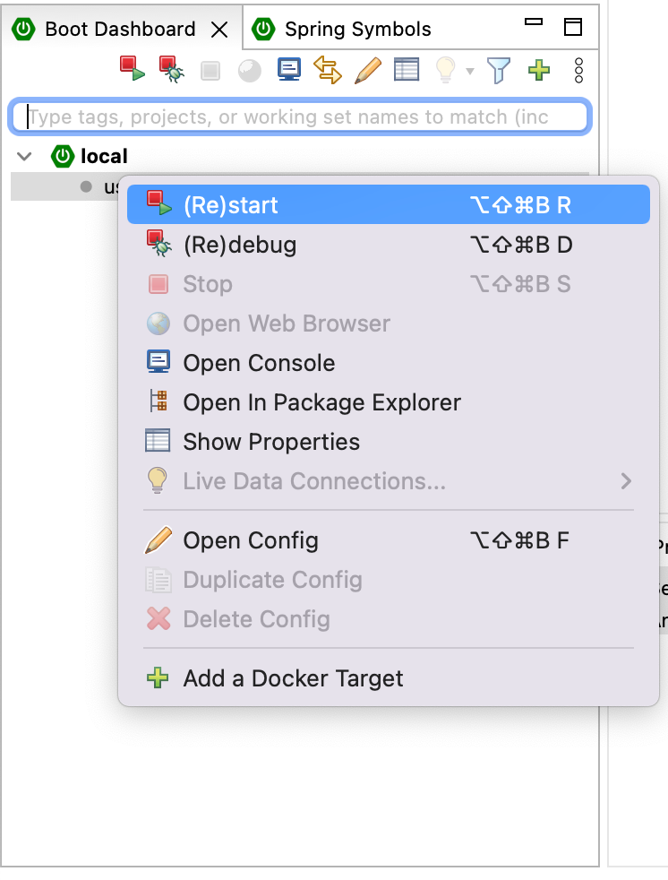
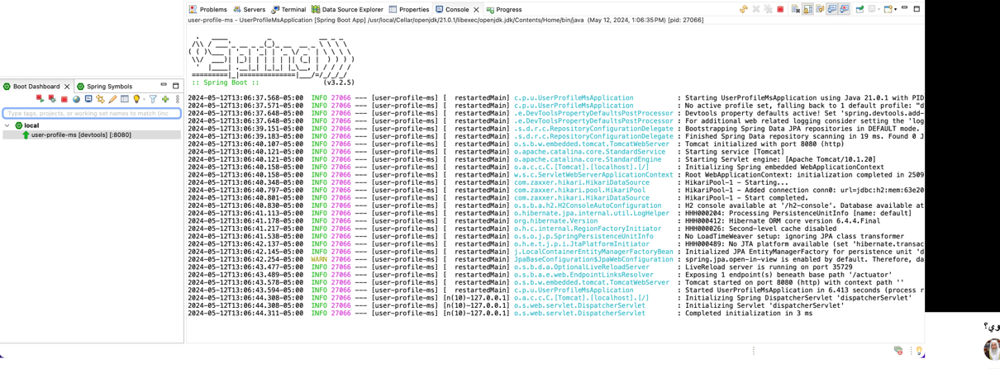

# Using Spring Initializr

This section will explain Spring Initializr and how to configure and start our project. Spring Initializr is a web application that can generate a Spring Boot project on the fly. It will configure the build file with the required dependencies to run our project, focusing only on the application's code. Spring Initializr makes it easier to set up our project with the help of the Spring Boot CLI on the side, which helps us configure our application. Spring Initializr generates a more traditional Java structure.

- There are several ways to use Spring Initializr:
  - Via a web-based interface
  - Via development IDEA like Intellij/ Visual Studio Code

We will use the official web method to generate our Spring Boot application. Access it at [Spring Initializr](https://start.spring.io/). You will see a form asking for:

- Build tool (Maven or Gradle)
- Language
- Artifact name
- Project name
- Package name
- JDK version
  

The form will ask you for some basic information about your project. The first question is, what is your choice between Maven and Gradle to build your project? The app will also need information such as what language you will use, the artifact name, project name, and package name to be used, and what JDK version will be used when building the application.

Now, on the right side of the interface, you will see the Add Dependencies button. This is one of the most important features of Spring Initializr, as it allows us to choose the dependencies depending on our project's needs. For example, if we need a relational database with JPA access, we should add the Spring Data JPA.

Therefore, we added Spring Web, Spring Boot Actuator, Spring Boot DevTools, Spring Data JPA, and H2 Driver in the following example. We will also discuss each dependency as we build our example application.

In the preceding process, we can see that we have already added the dependencies we need in our project. The last step is to generate our application by clicking the Generate button; this will download a zip file containing our application. Before generating our project, we can click the Explore button to check our project structure and verify the configuration.

After successfully downloading the generated Spring Boot application, we will extract the file, and we can now open the Spring Boot project with the IDE of our choice. Finally, we are ready to write our code, but first, let’s check out the project structure generated by Spring Initializr.

> We can see from the generated project that only a little application code is included. However, the project consists of the following:

- **UserProfileMsApplication.java**: A class with the main() function for the application bootstrap
- **UserProfileMsApplicationTests.java**: An empty JUnit test class for unit testing
- **Pom.xml**: A Maven build specification that contains the dependencies needed for the application.
- **Application.properties**: A properties file that is used to add configuration properties. This can be renamed application.yml to use YAML format.

The generated project includes empty directories, such as the static folder; this is significant, as this is where static content, such as CSS and JavaScript files, is placed.

---

# Starting project inside Eclipse

After successfully downloading and installing Java, Eclipse, Mvn, and git, let’s start by installing **Spring Tools** and **JUnit Tools 4 Spring** from the Eclipse Marketplace, `Help > Eclipse Marketplace`.

After finishing the required installations and configuration, let's modify some views inside Eclipse `Window > Show View > Other...`. A popup will show ‘Show View’ search for spring and select “Other/Spring Symbols.”
 

After successfully installing the required plugins from the Eclipse marketplace, let’s import the project downloaded in the previous steps. Select F`File > Import > Maven > Existing Maven Projects` from the Eclipse main menu.

It is time to start our project from the Boot Dashboard/ `local/user-profile-ms`. Right-click and then select **(Re)start**. This will start by downloading the required dependencies and files.

From the Console tab, you can check the console logs showing the project’s start and initialization.

---
